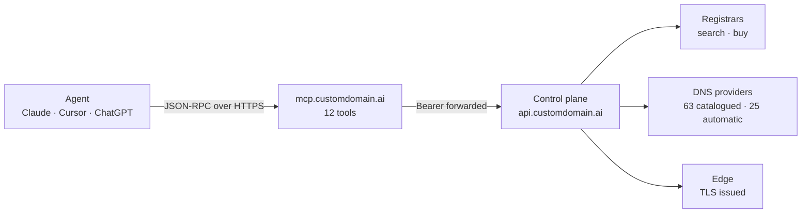
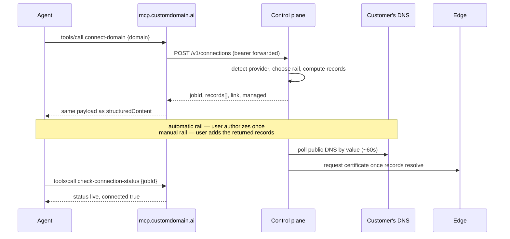

# Custom Domain MCP

MCP server for custom domains — let Claude and other AI agents search, buy, connect and verify domains

**Status:** Production · server v0.4.0 · public

[](https://customdomain.ai/mcp-server)
[](https://registry.modelcontextprotocol.io/v0/servers?search=ai.customdomain%2Fmcp)
[](https://docs.customdomain.ai/docs/mcp/overview)
[](./LICENSE)

[Product page](https://customdomain.ai/mcp-server) · [MCP docs](https://docs.customdomain.ai/docs/mcp/overview) · [Tool reference](./TOOLS.md) · [Provider coverage](https://docs.customdomain.ai/docs/providers) · [Pricing](https://customdomain.ai/pricing)

|  |  |
|---|---|
| **What it is** | A hosted MCP server that gives an AI agent twelve domain tools |
| **Who it's for** | Agent builders, SaaS platforms and coding-agent users who need a customer on their own domain |
| **Live at** | [customdomain.ai/mcp-server](https://customdomain.ai/mcp-server) · endpoint `https://mcp.customdomain.ai/mcp` |
| **Stack** | Go 1.25 · JSON-RPC 2.0 over streamable HTTP · hosted, no datastore in the server |
| **Status** | Production · v0.4.0 in the official MCP registry · 12 tools · 63 DNS providers catalogued, 25 automatic |

Custom Domain MCP is a hosted [Model Context Protocol](https://modelcontextprotocol.io) server that lets an AI
agent put a person on their own domain: find one, buy it, connect one they already own, set up its email
records, and watch it go live with HTTPS. It replaces the part of that job a human normally does by hand in a
DNS control panel. There is nothing to install and nothing to keep running — point your MCP client at the
endpoint above.



---

## The problem

Every SaaS product eventually needs a customer on their own domain — a white-label app host, a vanity link, a
sending domain for email. The work is small and it is always the same: figure out who runs the customer's DNS,
write the right records in the right shapes, wait for them to propagate, then get a certificate. Done by hand
it is a support ticket. Done in code it is a DNS provider integration you did not want to own, times sixty.

Agents make this worse before they make it better. The obvious way to let an agent do the job is to give it
DNS credentials and a way to write records, which means one confused turn or one poisoned web page can now
edit a customer's zone. Nobody wants to hand a language model a `SetRecords` call on a production domain, and
the alternative — an agent that reads instructions aloud and asks the user to go type them somewhere — is the
support ticket again, with extra steps. That is not a permissions problem you can prompt your way out of; it
is an argument-list problem, and it gets solved by changing what the agent is able to say.

## Who it's for

- **Teams building agents that ship things.** A coding agent, a site builder, a deploy bot — anything whose
  output is a running app that needs an address a person will actually type. The agent does the whole job in
  four tool calls instead of stopping at the last mile with a paragraph of DNS instructions.
- **SaaS platforms with tenant domains.** If your customers connect their own domain to your product, this is
  the same engine the [Custom Domain](https://customdomain.ai) widget and REST API run on, reached through the
  protocol your agents already speak.
- **Email and messaging platforms.** Getting a sending domain authenticated — MX, SPF, DKIM, DMARC, in the
  right shapes, at the customer's provider — is one call here instead of a documentation page and a support
  queue.
- **Anyone with a domain portfolio to keep alive.** Connections drift, certificates need records that still
  resolve, and an agent that can list, diagnose and re-apply is cheaper than a person doing it quarterly.

## What it does

Twelve tools, one credential, no DNS records in any argument. Each of these is a tool call, not a workflow you
have to assemble:

- **Check whether a domain can be registered**, with live purchase and renewal pricing — `search-domain-availability`
- **Suggest names that are actually free**, deterministically, from a set of keywords — `generate-domain-suggestions`
- **Register a domain** through the resolved registrar, behind a fail-closed authorization gate — `create-domain-order`
- **Connect a domain the customer already owns** and get back the exact records that must exist — `connect-domain`
- **Detect the DNS provider before you ask anyone for anything**, with conflict and CAA pre-flight — `discover-provider`
- **Poll a connection to completion**, from records written to certificate issued — `check-connection-status`
- **Poll a registration order** across two different ledgers without guessing which one applies — `check-order-status`
- **Set up email in one call** — MX, SPF, DKIM and DMARC from a server-side template — `add-email`
- **Point a domain somewhere permanently** with a 301 — `forward-domain`
- **Repair a domain that drifted** out of `live`, using a stored grant — `reapply-connection`
- **Take a domain down cleanly**, reverting its DNS first — `disconnect-domain`
- **Inventory the whole account** so an agent can reconcile a portfolio, not just the job it started — `list-connections`

Full arguments and response shapes: **[TOOLS.md](./TOOLS.md)**.

The receipts, all verifiable from outside: the server is published in the official MCP registry as
[`ai.customdomain/mcp`](https://registry.modelcontextprotocol.io/v0/servers?search=ai.customdomain%2Fmcp) at
v0.4.0, speaks protocol revision `2025-06-18`, and answers an unauthenticated call with a
[RFC 9728](https://datatracker.ietf.org/doc/html/rfc9728) challenge that names its own metadata document
rather than a bare 401. Automatic setup covers **25 of the 63 DNS providers catalogued** — 17 by scoped API
token, 6 by provider OAuth, 2 by provider-hosted one-click — and the other 38 still work, returning records
and a link for a human to apply.

Every one of those tools was built against the same lesson: an agent that returns a console link and stops has
not done the job. The tools return the authoritative record set itself, so the agent can tell a person exactly
what to add, and the completion signal is a boolean rather than a status string an integration can misread.

## Use cases

- **A coding agent shipping a side project.** "Find me a domain under $20, buy it, and point it at this app."
  Search, order, connect, poll — four calls, no console visit.
- **A SaaS onboarding an enterprise customer.** The agent calls `discover-provider` first, sees the customer
  runs an apex-incapable provider, and warns before anyone authorizes anything.
- **An email platform.** `add-email` writes MX, SPF, DKIM and DMARC from a template; the agent supplies the
  per-domain DKIM selector and nothing else.
- **A platform with a thousand tenant domains.** `list-connections` with `status=failed`, keep the rows with
  `managed: true`, `reapply-connection` on those, escalate the rest to a human. That is a reconciliation loop
  an agent can run on a schedule, and it is the reason the inventory tool exists at all.
- **A support agent answering "why is my domain not working yet".** `check-connection-status` returns the
  status, the records, and an error code that distinguishes "the records were never added" from "they were
  added and have not propagated". Those are two different replies to the customer.

## Why an MCP server and not a REST API

There is a REST API, and it is the thing this server calls. The difference is what an agent is allowed to say.
The REST API accepts DNS records; the MCP tools do not. Every record value is computed by the control plane
from a vetted template, so the worst thing a prompt-injected agent can do here is connect the wrong domain —
not write an arbitrary `MX` record into a customer's zone. The security model is the argument list. Paid
registration is gated separately: `create-domain-order` places an order only after the integrator's
purchase-authorization callback approves it, and an unconfigured callback denies every purchase.

The second reason is discovery. An agent that has never heard of this product can find it: the server is in
the official MCP registry, it publishes an agent manifest and an OAuth protected-resource document at
well-known paths, and an unauthenticated call answers with a challenge naming its protected-resource document
rather than a bare 401. A REST API cannot introduce itself that way. The manifest carries the intent keywords
a person would actually use — connect a domain, bring your own domain, white-label domain, set up email for a
domain — so the match happens before anyone writes an integration.

---

## Quickstart

Get an API key from the console at [app.customdomain.ai/signup](https://app.customdomain.ai/signup). Keys look
like `sk_live_...` and are shown once, at creation. The free Starter plan covers every tool here except
`create-domain-order`, which places a real paid registration.

**Claude Code** — one command:

```bash
claude mcp add --transport http customdomain https://mcp.customdomain.ai/mcp \
  --header "Authorization: Bearer sk_live_YOUR_KEY"
```

**Cursor** — add to `.cursor/mcp.json`:

```json
{
  "mcpServers": {
    "customdomain": {
      "url": "https://mcp.customdomain.ai/mcp",
      "headers": { "Authorization": "Bearer sk_live_YOUR_KEY" }
    }
  }
}
```

**Any HTTP client** — the endpoint is plain JSON-RPC 2.0, so you can call a tool with curl:

```bash
curl -X POST https://mcp.customdomain.ai/mcp \
  -H "Authorization: Bearer sk_live_YOUR_KEY" \
  -H "Content-Type: application/json" \
  -d '{"jsonrpc":"2.0","id":1,"method":"tools/call",
       "params":{"name":"discover-provider","arguments":{"domain":"example.com"}}}'
```

Claude Desktop reaches HTTP servers through `mcp-remote`; ChatGPT reaches them as a developer-mode connector.
Both configs are on the [product page](https://customdomain.ai/mcp-server).

## Client support

| Client | How it connects | Notes |
|---|---|---|
| Claude Code | Native streamable HTTP | `claude mcp add --transport http` |
| Claude Desktop | `npx -y mcp-remote` bridge | Needs Node 18+ on the machine |
| Cursor | Native HTTP with headers | Project or global `mcp.json` |
| ChatGPT desktop | Developer-mode connector | Availability varies by plan |
| Anything else | `POST /mcp`, JSON-RPC 2.0 | Bearer in the `Authorization` header |

## Tools and the two conventions

Two rules run through every tool, and they are the two things integrators get wrong.

**No tool accepts a DNS record.** `add-email` takes mail settings — an MX host, a DKIM selector — and the
template turns those into records. `forward-domain` takes a redirect target. Neither takes a record.

**`connected: true` is the completion signal.** Status strings are informative; the boolean is what you branch
on, and it stays stable if the status enum ever grows.

There is also no ownership-challenge step: no tool asks for or checks a TXT verification record. Control of
the domain is proven by the rail that writes the records — an OAuth authorization at the provider, a one-click
apply, or a scoped API token — and on the manual path the control plane simply waits for the records to appear
in public DNS.

## Authentication

`POST /mcp` accepts three bearer credentials.

| Credential | Issued by | Scope |
|---|---|---|
| API key `sk_live_` / `sk_test_` | The console, under an application. Shown once, stored only as a hash. | The whole tenant |
| JWT from `POST /token` | `client_credentials` exchange using `application_id` + `client_secret`. Expires in an hour. | One application |
| `CLIENT_ID:CLIENT_SECRET` | The `mcp-remote` shortcut format for the same exchange | One application |

```bash
curl -X POST https://mcp.customdomain.ai/token \
  -u "<APPLICATION_ID>:<CLIENT_SECRET>" \
  -d "grant_type=client_credentials"
# -> { "access_token": "eyJ...", "token_type": "Bearer", "expires_in": 3600 }
```

`APPLICATION_ID` and `CLIENT_ID` are the same value under two names. Prefer the JWT when an agent only needs
one application: a leaked `sk_live_` key carries the whole tenant. The server does not validate credentials
itself — it forwards the bearer to the control plane, which enforces the same application-scoped permissions
as the REST API, so revoking a key in the console cuts the agent off on its next call. See
[Authentication](https://docs.customdomain.ai/docs/authentication/overview).

## Lifecycle, polling and errors

Connections move `pending` → `propagating` → `live`, with `failed` as the one terminal error state.

| Status | Meaning |
|---|---|
| `pending` | Created. Records not yet written, or not yet observed in public DNS. |
| `propagating` | A rail wrote the records. The poller is checking them against public DNS by value. |
| `live` | Every desired record resolves to its intended value and the edge serves TLS for the host. |
| `failed` | Records never appeared inside the window. Carries `error_code` `propagation_timeout` or `setup_incomplete`. |

The background poller re-checks about once a minute, so polling faster than every 30–60 seconds gains nothing.
The give-up windows differ by path: 24 hours in `propagating` on an automatic rail, 72 hours from `pending` on
the manual path, because a human has to get to their DNS provider. Both error codes clear automatically if the
connection later re-verifies, so `failed` is recoverable and is not a reason to tell a user to start over.

Errors come in two shapes. A malformed call fails at the JSON-RPC layer — `-32602` for invalid parameters,
`-32601` for an unknown tool, `-32700` for unparseable JSON. Those are caller bugs. A call the control plane
refused comes back as a normal tool result:

```json
{ "success": false, "error": "connect_failed", "message": "Domain already connected to another application" }
```

Branch on `error`; show `message`.

## How it works

This repository is the public face of a hosted service: the registry manifest that lists the server, the tool
contract, and this page. The server itself is a small Go process. It terminates JSON-RPC, checks nothing it
does not have to, and forwards each tool call to the Custom Domain control plane, which owns provider
detection, the record templates, the registrar rails, the propagation poller and certificate issuance. That
split is why the tool surface can stay this narrow: all the state and all the judgment live one hop away.

### Repository layout

```text
.
├── README.md      # this file — what the server is, how to point a client at it, how it is built
├── TOOLS.md       # the tool contract: every argument, every response field, every status value
├── server.json    # MCP registry manifest — name ai.customdomain/mcp, version 0.4.0, remote endpoint
├── glama.json     # Glama directory ownership claim
└── LICENSE        # MIT
```

### Service modules

The server source lives in the private Custom Domain monorepo under `services/mcp`, alongside the control
plane it calls. Named here so the boundaries are legible, not linked, because the repository is closed.

| Module | Purpose | Talks to |
|---|---|---|
| `server.go` | Routes `initialize`, `tools/list`, `tools/call`; registers the twelve tools in a fixed order | `tools.go`, `usage.go` |
| `tools.go` | Tool definitions, JSON schemas, annotations and handlers | `client.go` |
| `jsonrpc.go` | JSON-RPC 2.0 framing and error codes | `transport.go` |
| `transport.go` | The stdio and streamable-HTTP transports | `server.go` |
| `client.go` | The `ControlPlane` port — the interface every tool handler calls | implemented by `httpclient.go` |
| `httpclient.go` | HTTP adapter onto the control-plane REST API | `api.customdomain.ai` |
| `auth.go` | Bearer extraction and the RFC 9728 `WWW-Authenticate` challenge | control plane |
| `purchaseauth.go` | The fail-closed purchase-authorization callback, checked before any paid order | integrator callback |
| `registrar.go` | Registrar resolution and preferred-registrar ordering | control plane |
| `agenttoken.go`, `scopes.go` | Delegated agent tokens and per-tool scope enforcement | control-plane JWKS |
| `wellknown.go` | Serves `/.well-known/oauth-protected-resource` and `/.well-known/agent/mcp.json` | — |
| `usage.go` | Batched, drop-on-full usage recorder; never blocks a tool call | control-plane ingest |
| `cmd/mcp/main.go` | Process entry point: flags, environment, Sentry, OpenTelemetry | all of the above |

Entry point: `services/mcp/cmd/mcp/main.go`.

### The flow that matters

Connecting a domain someone already owns is the flow everything else is shaped around.



### Invariants

- **No tool accepts a DNS record as input.** Record values are computed server-side from vetted templates.
  This is the security model, not a gap.
- **The server has no database.** Its `go.mod` pulls Sentry and OpenTelemetry and nothing else; every fact a
  tool returns was fetched from the control plane during that request.
- **There is no ownership-challenge step.** No tool asks for or checks a TXT verification record.
- **Nothing in this repository is deployed.** No build, no CI, no server source — the files here are read by
  the MCP registry and by people, and the endpoint ships from elsewhere.
- **`POST /v1/connections` is idempotent per application and domain**, so a repeated `connect-domain` resumes
  the existing connection and returns `already_connected: true` rather than creating a second one.

<!-- verified against 18d6036 (this repo) and services/mcp on the monorepo default branch, 2026-09 -->

## Configuration

**What you set, as a client.** There are no environment variables to set in this repository.

| Setting | Required | Default | Purpose |
|---|---|---|---|
| Endpoint URL | yes | — | `https://mcp.customdomain.ai/mcp` |
| `Authorization` header | yes | — | `Bearer sk_live_...`, a JWT from `/token`, or `CLIENT_ID:CLIENT_SECRET` |
| Token URL | only for JWTs | — | `https://mcp.customdomain.ai/token` |

Keep the key out of the config file where your client supports it. If it lives in 1Password, reference it as
`op://<vault>/customdomain/api-key` and inject it at launch — never paste a literal key into a repository, a
`.cursor/mcp.json` you commit, or an issue.

**How the hosted service is configured.** Listed because two of these change what the tools do, and integrators
ask why a purchase was denied. Secret values are injected at deploy time and appear in no repository.

| Variable | Required | Default | Purpose |
|---|---|---|---|
| `MCP_ADDR` | no | `:8080` | HTTP listen address |
| `MCP_API_BASE` | no | `https://api.customdomain.ai` | Control-plane base URL |
| `MCP_PUBLIC_BASE` | no | `https://mcp.customdomain.ai` | Public origin stamped into the discovery documents |
| `MCP_LINK_BASE` | no | console URL | Prefix for the guided-DNS fallback links returned to agents |
| `MCP_PURCHASE_AUTHZ_URL` | for purchases | unset | Authorization callback. **Unset denies every paid order.** |
| `MCP_PURCHASE_AUTHZ_USER` | with the URL | unset | Basic-auth user for that callback |
| `MCP_PURCHASE_AUTHZ_PASSWORD` | with the URL | unset | Basic-auth password for that callback (injected, never stored) |
| `MCP_AGENT_JWKS_URL` | no | unset | JWKS for delegated agent tokens. **Unset leaves the agent-token path dark.** |
| `MCP_PREFERRED_REGISTRAR` | no | unset | Registrar tried first during order resolution |
| `MCP_USAGE_INGEST_KEY` | no | unset | Enables usage recording; unset makes the recorder a no-op |
| `MCP_USAGE_INGEST_URL` | no | derived from `MCP_API_BASE` | Where usage batches are posted |
| `CUSTOMDOMAIN_API_TOKEN` | stdio only | unset | Static control-plane bearer for the local stdio transport |
| `MCP_INSECURE` | no | unset | Serves `/mcp` with no bearer check. Refused on production hosts. |
| `SENTRY_ENVIRONMENT` | no | unset | Environment tag; also what the production guard reads |
| `OTEL_EXPORTER_OTLP_ENDPOINT` | no | unset | Opt-in tracing; no-op when unset |

## Development and testing

There is no build here. The repository holds two JSON manifests and two Markdown documents, so the checks are
proportional:

```bash
git clone https://github.com/CUSTOM-DOMAIN-APP/customdomain-mcp.git
cd customdomain-mcp
jq -e . server.json glama.json > /dev/null && echo "manifests parse"
```

`server.json` must validate against the MCP registry schema it declares
(`https://static.modelcontextprotocol.io/schemas/2025-12-11/server.schema.json`), and its `version` must match
the version published to the registry. `TOOLS.md` is the contract: if a tool argument or a response field
changes upstream, the change is not done until it is reflected there.

The service itself is Go 1.25 and carries **82 test functions across nine test files** covering the protocol,
the transport, the control-plane adapter, the purchase gate, scope enforcement and the consistency of the
discovery documents. It is exercised with `go build ./... && go test ./...` in the monorepo, plus a `-race`
pass, before anything reaches the endpoint.

A live smoke test needs only a key:

```bash
curl -s -X POST https://mcp.customdomain.ai/mcp \
  -H "Authorization: Bearer $CUSTOMDOMAIN_KEY" -H "Content-Type: application/json" \
  -d '{"jsonrpc":"2.0","id":1,"method":"tools/list"}' | jq '.result.tools | length'
# -> 12
```

## Deployment and operations

Two things ship on different tracks, and confusing them is how a version string goes stale.

**This repository** ships to directories. `server.json` is the manifest the official MCP registry reads for
`ai.customdomain/mcp`; `glama.json` is the ownership claim for the Glama directory. Publishing a change means
bumping `version` in `server.json` and re-publishing the manifest to the registry. To roll back: revert the
commit and re-publish the previous version. Nothing here is on the request path, so a bad commit here cannot
take the endpoint down.

**The endpoint** ships from the private monorepo as a distroless container fronted by Caddy behind Cloudflare,
with a `/healthz` probe built into the binary (`-probe`, because the image has no shell). It is deliberately
**unversioned**: your client always reaches the deployed build, a tool added upstream appears with no change on
your side, and rollback is a redeploy of the previous image with no client action at all. Pin your integration
to tool names and to the `connected` boolean, not to a version string.

Operational levers, in the order you would reach for them: revoke the key in the console to cut off a
misbehaving agent immediately; unset `MCP_PURCHASE_AUTHZ_URL` to deny all purchases; watch Sentry for the
service and the control plane. Tool-affecting changes are recorded in the
[docs changelog](https://docs.customdomain.ai/docs/changelog).

## Known limitations

- **38 of the 63 catalogued DNS providers have no automatic rail.** The tools still work — they return the
  records plus a link — but a human adds them. Call `discover-provider` first to find out which case you are
  in. The breakdown is published at [Providers](https://docs.customdomain.ai/docs/providers).
- **An agent cannot finish a manual connection alone.** The design is link-mediated on purpose: the agent
  returns a link and polls; a human does the money step and, where there is no automatic rail, the DNS step.
- **Delegated agent tokens are not enabled on the hosted service.** The scope-enforced, short-lived token path
  is built and tested but dark, so an agent acts with whatever credential you hand it.
  See [Agent access](https://docs.customdomain.ai/docs/agents/overview).
- **No arbitrary DNS writes, ever.** If you need to write records you supply, this is the wrong server; use
  the REST API or your provider's own.
- **`list-connections` reads a single page** at the control plane's default limit. Filter by `status` rather
  than paging a large portfolio.
- **There is no published per-request rate limit**, so do not build on the absence of one. Connections are
  metered per UTC calendar month against the plan allowance.
- **The server source is not in this repository.** This is the manifest and the contract; the server is hosted.

## Security

No credential belongs in this repository, and none is here. API keys are shown once and stored only as a hash;
the MCP server holds no key of its own and forwards yours. Prefer an application-scoped JWT over a tenant-wide
`sk_live_` key for anything an agent touches. Report a vulnerability privately to connect@customdomain.ai
rather than opening an issue.

## Related

- [connect-domain-for-ai-agents](https://github.com/CUSTOM-DOMAIN-APP/connect-domain-for-ai-agents) — the field guide for agent stacks
- [customdomain-sdk](https://github.com/CUSTOM-DOMAIN-APP/customdomain-sdk) — the official JS/TS client for the REST API
- [awesome-custom-domains](https://github.com/CUSTOM-DOMAIN-APP/awesome-custom-domains) — the map of the whole space, including the alternatives
- [docs](https://github.com/CUSTOM-DOMAIN-APP/docs) — source of [docs.customdomain.ai](https://docs.customdomain.ai/docs)

## Contributing

Issues and pull requests on the documentation and the manifests are welcome here. Changes to tool behaviour
happen upstream in the private monorepo — open an issue describing the behaviour you need and it will be
routed. Keep `TOOLS.md` and the live tool schemas in agreement; a PR that changes one without the other will
be asked for the other.

## License

[MIT](./LICENSE) © CustomDomain.ai

Maintained by [CustomDomain.ai](https://customdomain.ai). Questions: connect@customdomain.ai.
